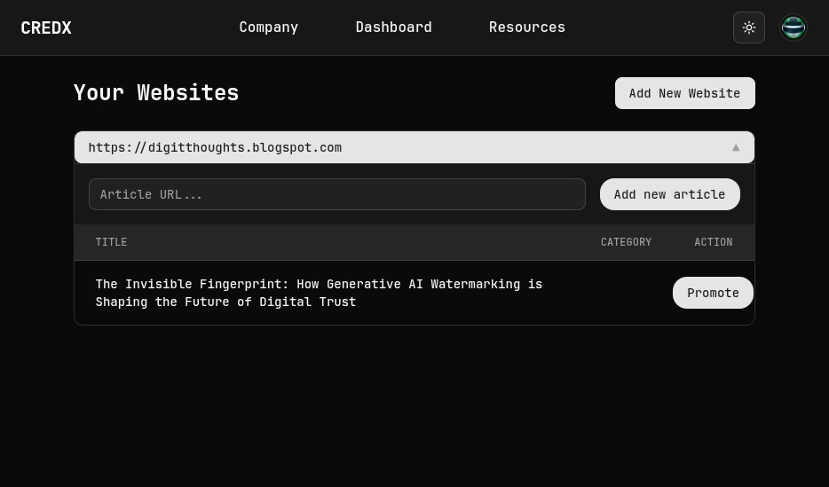
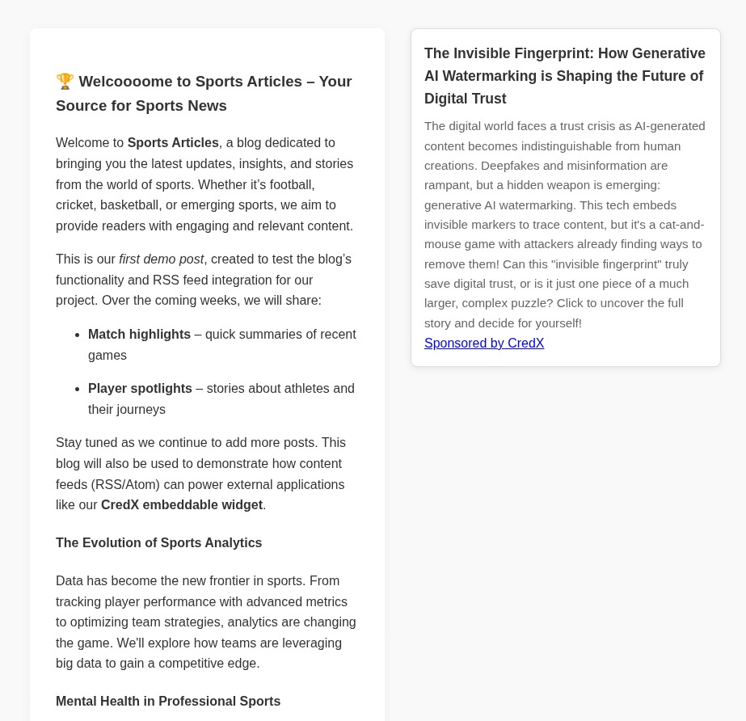

# CredX — Publisher Revenue and Recommendation Platform

CredX is a monolithic repository containing a production-grade Next.js web application and a set of Python microservices for content scraping, classification and promotion workflows. This repository is structured so the web frontend and backend microservices can be developed and deployed together or independently.

Quick links
- Web app: `web/` (Next.js)
- Microservices: `microservices/` (Python)
- Database migrations: `web/migrations/` (node-pg-migrate)

## Highlights

- Modern Next.js frontend (App Router) with Prisma client for data access.
- Postgres-backed database and pgvector support for embeddings.
- Python microservices: classifier, scraper, controller providing embedding, classification, scraping and queue-based workflows.
- Node-driven SQL migrations (`node-pg-migrate`) for DB schema management.
- Designed for extensibility: swap embedding providers, add promotion strategies, or scale microservices independently.

## Screenshots




## Quick start (development)

Prerequisites:
- Node.js (18+) and npm
- Python 3.10+ and virtualenv
- PostgreSQL (local or remote)

1. Web app (frontend)

```bash
cd web
npm install
# create .env (see web/README.md for keys)
cp .example.env .env
npm run dev
# open http://localhost:3000
```

1. Microservices 

```bash
cd microservices
python3 -m venv .venv
source .venv/bin/activate
pip install -r requirements.txt
# copy .env and set keys
cp .example.env .env
python main.py
```

4. Database migrations

```bash
cd web
# run migrations (node-pg-migrate reads DATABASE_URL)
npm run migrate -- up

# optionally, pull and generate Prisma client
npx prisma db pull
npx prisma generate
```

See `web/README.md` and `microservices/readme.md` for detailed per-project instructions.

## Architecture overview

- Frontend: Next.js (React) — UI, pages, and API routes.
- Database: PostgreSQL (+ pgvector extension for vectors).
- Microservices: Python processes handling scraping, classification, tagging, and embedding. They talk to the web API and DB where appropriate.
- Migrations: `node-pg-migrate` manages SQL migrations in `web/migrations/`.

## Contributing

1. Fork and branch
2. Make changes and add tests where appropriate
3. Open a pull request describing your changes

## Where to find things

- Web app source: `web/src/`
- Prisma schema: `web/prisma/schema.prisma`
- Web migrations: `web/migrations/`
- Microservices: `microservices/`

## 🚀 **Connect With Me**

- **GitHub:** [@vedantjain8](https://github.com/vedantjain8)
- **LinkedIn:** [vedantjain8](https://www.linkedin.com/in/vedantjain8/)

This project is licensed under the [GNU General Public License v3.0](https://github.com/vedantjain8/credx/blob/main/LICENSE)